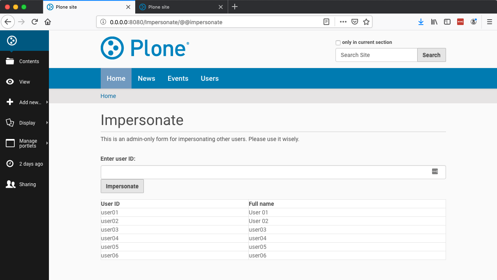

======================
collective.impersonate
======================

This add-on allows an administrator to impersonate another user.

This is useful for verifying workflows, permissions, and roles set up on real content and on live sites.

How to Impersonate a User
-------------------------

You must be logged in as a user with Manager or Site Administrator role.

Use the Impersonate item in your personal menu at the bottom of the toolbar.

You will see a form that displays the users on your site, listing user IDs and full names.

In the "Enter user ID" field, enter the ID of the user you want to impersonate, then press the Impersonate button.

You will see the name of the impersonated user appear on the personal menu toolbar button in the bottom left corner of
your browser window.

Site Interactions
-----------------

You can navigate throughout and interact with your site as the impersonated user.
Content items will be displayed according to the security settings of the impersonated user (roles, permissions, and
group memberships), and their workflow state.

How to Stop Impersonating a User
--------------------------------

Log out to stop impersonating a user. You can use Log Out in the personal menu toolbar button.

Sites With Many Users
---------------------

If your site has the "Many users" box checked in the Users and Groups control panel's Settings tab, the `@@impersonate`
form will not list the users on your site.

Instead, it will show a link to the Users and Groups search that you can
use to look up a user and their ID to enter into the "Enter user ID" field.

